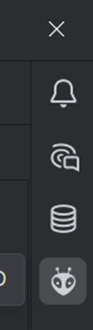
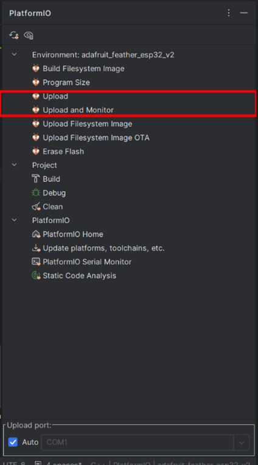

# Installatie
## Stap 1. Installeer Clion
Installeer Clion hier: https://www.jetbrains.com/help/clion/installation-guide.html

## Stap 2. Installeer de PlatformIO plugin
Installeer de PlatformIO plugin voor Clion hier: https://plugins.jetbrains.com/plugin/13922-platformio-for-clion

## Stap 3. Open het project
Open het project met Clion en wacht tot deze geïmporteerd is.

## Stap 4. Upload het programma
Verbind de esp32 met usb aan je apparaat.

Open het PlatformIO menu

Klik op upload of upload en monitor om het programma te compileren en te uploaden.
